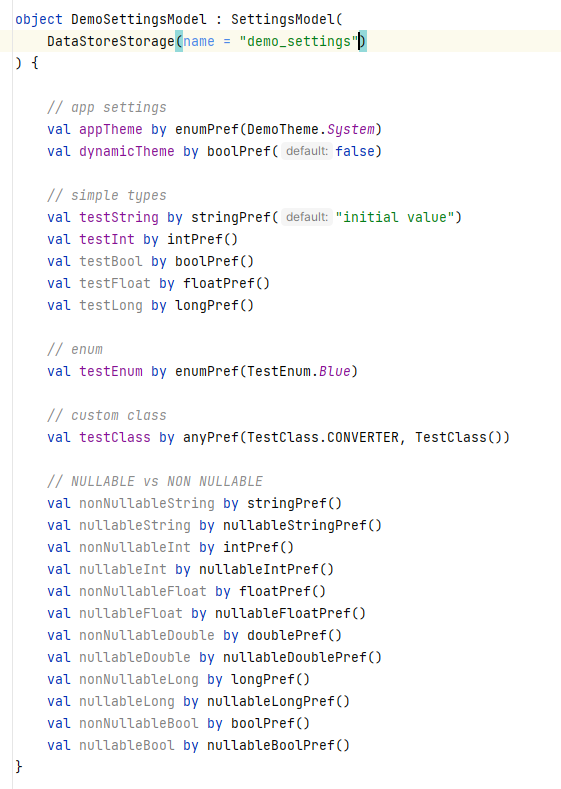

### About

With this library you can declare preferences via **kotlin delegates** and observe and update them via kotlin Flows. This works with any storage implementation, an implementation for JetPack DataStore is provided already.

This is KMP (kotlin multiplatform) library and the provided modules do support following platforms:

**Supported Platforms**

| Modules        | Android | iOS | jvm | Information |
|:---------------|---------|-----|-----|-------------|
| core           | √       | √   | √   |             |
| datastore      | √       | √   | √   |             |
| encryption-aes | √       |     |     | (1)         |
| compose        | √       | √   | √   |             |

* (1) Currently I only provide an encryption module for android. Pull requests with implementations for other platforms are welcome.

## :camera: Screenshots

|  |
| :-: |

## :book: Documentation

The readme for this library with **code samples**, **screenshots** and more can be found on following *github page*:

Additionally there is also a full working [demo app](demo) inside the *demo module*.